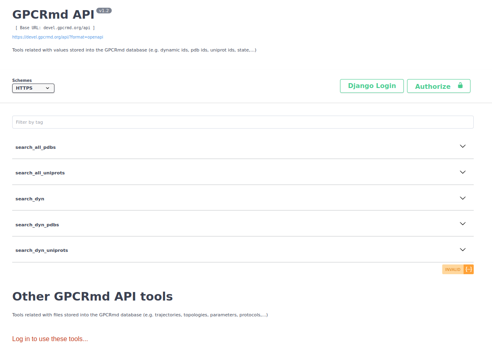
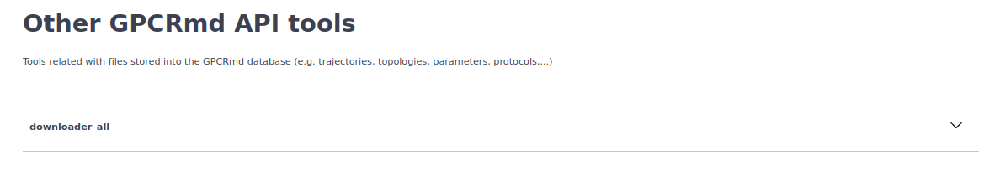
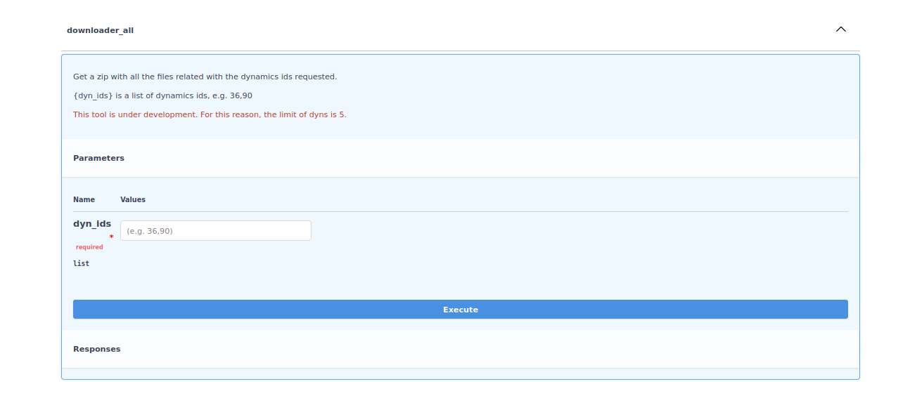

============
Web services
============

.. contents:: 
    :depth: 2

The GPCRmd API is oriented to facilitate to users to acces to the information of GPCRmd database more efficienty and fastest using coding and urls. Behind this tool we used the framework django-rest with the updated Swagger version under the name of `drf_yasg`. 

As it can be observe in the image above, the api is divided into two sections: 

* Main GPCRmd API: list of tools to obtain data from the GPCRmd database. 
* Other GPCRmd API: group of tools related with the obtain of files from GPCRmd, like structures. *Note: this group of tools need an account on GPCRmd.* 
  
Main GPCRmd API
===============

This part of the API is related with the data stored in the GPCRmd database. Here, the user can found functions from retrieve all pdbs on GPCRmd to retrieve the dynamics associated to a list of Uniprot codes:

.. image:: _static/gpcrmd_mainapi.png
  :width: 600
  :alt: GPCRmd main API

All the functions are GET functions but mainly, there are two types of functions: without input parameters or with them.

For one side, the functions without the need to use a parameter as input, like `search_all_pdbs`, the user only need to click on "Try out" and then on "Execute".

.. image:: _static/gpcrmd_apinoparam.png
  :width: 600
  :alt: GPCRmd functions without parameters

Next, the server will process the request of the user retrieving the result. In the example case of `search_all_pdbs`, the response is a json with all the codes PDB stored in GPCRmd. 

.. note::
  The user can download this json using the "Download" button on the bottom or use the url to obtain directly the json.

.. image:: _static/gpcrmd_apinoparamex.png
  :width: 600
  :alt: GPCRmd functions without parameters response

For the other side, the functions with the need of an input, like `search_dyn`, when it is click on "Try out" the web display the input parameters necessaries to retrieve the information from GPCRmd.

.. image:: _static/gpcrmd_apiparam.png
  :width: 600
  :alt: GPCRmd functions with parameters

Once the response is recived, the user can see the json with all the information requested. 

.. note::
  In case that the user use as input a list of elements separated by comma, the api will return a json with multiple elements.

.. image:: _static/gpcrmd_apiparamex.png
  :width: 600
  :alt: GPCRmd functions with parameters response

.. image:: _static/gpcrmd_apiparamjson.png
  :width: 600
  :alt: GPCRmd functions with parameters response

Other GPCRmd API
================

This other part of the api is related with the files stored into GPCRmd. For security, to have a control of who's is downloading the data from the web it is necessary to be log in with a GPCRmd account (see `GPCRmd account guide <https://gpcrmd-docs.readthedocs.io/en/latest/accounts.html>`_). 

One of the functions is the downloader. The main function of this tool is to download all the files related to a dynamic, from topology to protocol files. 

.. warning::
  Now, is under development for this reason is restricted to 5 dynamics ids for each request. 

This process take some minutes because there are large files to collect, compressed and retrieve to the user. Let it run on the background.

Once, the compressed file is created the user can see a button named "Download" to start the download of the file: 

.. image:: _static/gpcrmd_othdownlink.png
  :width: 600
  :alt: GPCRmd other API downloader link

Each dynamic have is own directory, using the id. Into each directory the user can find all the files related with each dynamic. 

.. image:: _static/gpcrmd_othdownzip.png
  :width: 600
  :alt: GPCRmd other API downloader zip

In case that you found any problem, do not doubt on contact us to `info@gpcrmd.org`. 

