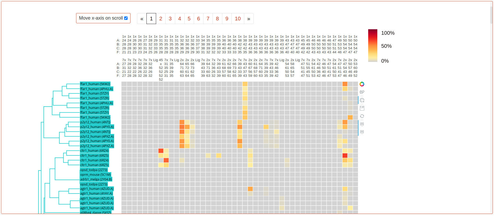

=============================
Receptor meta-analysis
=============================

This tool compares frequencies of non-covalent interactions occurring between GPCR residues or GPCRs and their ligands in all available simulated systems. Interaction frequencies have been calculated using GetContacts_, created by Rasmus Fonseca (fonseca.rasmus@gmail.com) and Anthony Ma (anthonyma27@gmail.com). Interaction frequencies are considered as the percentage of simulated time in which a residue pair is interacting, according to the `GetContacts interaction criteria`_. For simulations consisting of more than one trajectory file, the value displayed represents the average across all available trajectories. In addition, simulations have been hierarchically clustered according to their interaction frequency values.

.. contents::
    :depth: 2

Heatmaps and dendrograms
========================

These heatmaps display pre-calculated, non-covalent interaction frequencies (heatmap colour) between pairs of GPCR residues or ligand-residue (columns) in all available simulated systems (rows). To ensure comparability across systems, protein residues are labelled and aligned using `generic GPCR residue numbers`_ (GPCRdb structure-based numbering). This numbering system differs for each GPCR class, so a multi-class index has been used on the heatmap's axis. Only interacting pairs with a minimum of 50% interaction frequency in at least one simulation in the dataset are displayed. Same-helix interactions are not displayed. More information from a specific interaction can be displayed by clicking on its cell.

The accompanying dendrogram represents the results of the precomputed hierarchical clustering, with colours identifying the cluster each simulation has been assigned. Dendrograms are generated and displayed using the _plotly python library.

Full dataset options
********************

1. **Simulation datasets**: Include or exclude interactions of simulations submitted by individual contributors, not belonging to GPCRmd.
2. **Interaction type**: Select the type of non-covalent interaction whose frequencies will be displayed in the heatmap.
3. **Interaction partners**: Include interaction frequencies between GPCR residues, residue and ligand or both in the displayed results.
4. **N clusters**: The number of clusters the systems will be classified into and displayed in the dendrogram 
5. **Show reversed residue pairs**: Display each interaction twice in the heatmap, with the order of interacting residue pairs reversed (e.g.: 1x24-7x27 and 7x27-1x24).

After selecting your preferred options, click **Apply** to refresh the page with the new parameters. Use the **download** icon to download a CSV file with the displayed interaction values.

Customized dataset
******************

.. image:: _static/custom_dataset.png

Make a new heatmap with only the selected simulations in it. Use the **Select simulations** dropdown to specify your simulation subset, or click their name in the dendrogram. Finally, click apply to reload the metanalysis with only your specified systems. 
Clustering options are not available for customized selections 

Top representative interactions in clusters:
======================================================

Flareplots
**********

These plots display the *n* interacting pairs with higher frequency values within the simulations of each cluster. The colour of each path represents the average interaction frequency in this cluster, and correspond with the heatmap colourscale.To select a position on the flareplot, click on it. If available, this position will be displayed in the molecular viewer below. The number of displayed top interacting pairs can be changed with the dropdown embedded in the section description.

Plots are created using FlarePlots_, by Rasmus Fonseca (fonseca.rasmus@gmail.com) and Anthony Ma (anthonyma27@gmail.com).

1. **Show in structure***: Disable/Enable visualization of selected positions in the molecular viewer.
2. **Cluster N**: Select the cluster whose top interactions will be displayed in the flareplot. Clusters 1 and 2 are shown by default.
2. **Class X**: GPCR class whose generic numbering is to be displayed in the flareplot. Class A by default.
3. **Clear plot**: Unselect all previously selected paths or residues.

Molecule viewers
****************

The viewers at the bottom of the page (based on `NGL viewer`_) display simulations present in the clusters selected above, in the corresponding flareplot menu.

How to use them:

1. **Simulation**: Select the system to be displayed. Only the ones in the specified cluster are avaliable.
2. **Trajectory**: Select the trajectory file to display.
3. **View in workbench**: Open simulation in GPCRmd workbench for in-detail analysis
4. Press play to reproduce the simulation.

.. _GetContacts: https://github.com/getcontacts/getcontacts
.. _GetContacts interaction criteria: https://|URLDomain|/contmaps/contmaps/interaction_types
.. _plotly: https://github.com/plotly/plotly.py
.. _generic GPCR residue numbers: http://docs.gpcrdb.org/generic_numbering.html
.. _FlarePlots: https://github.com/GPCRviz/flareplot
.. _NGL viewer: https://github.com/arose/ngl
