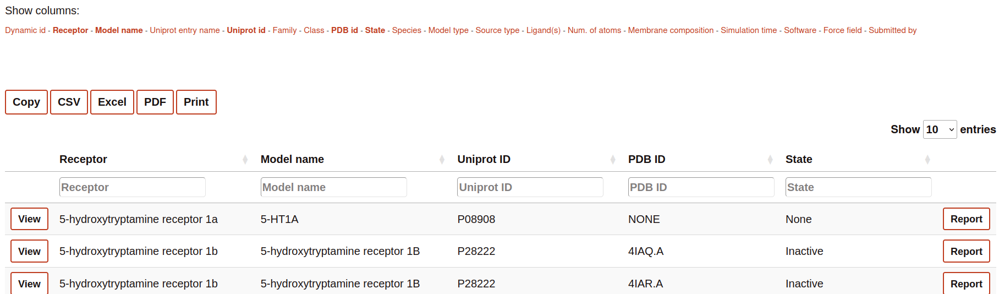
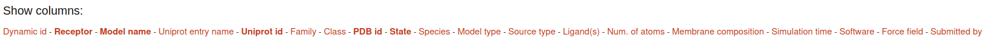
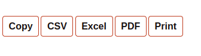
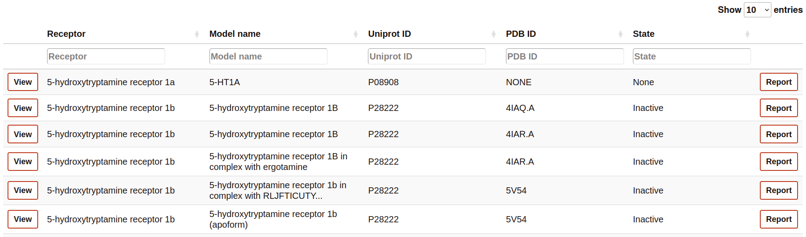
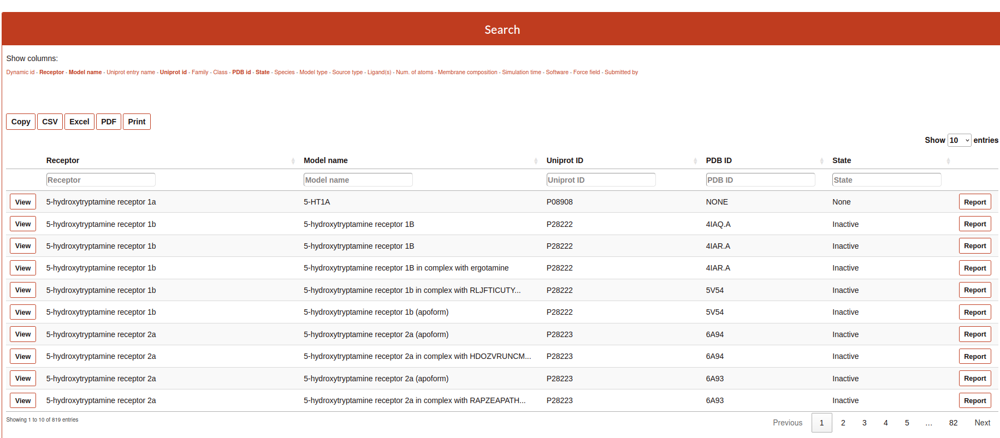

======
Search
======

The `Search` tool is divided into 4 parts: 

* Filter 
* Exporter
* Browser
* List of simulated systems

Filter                  
======

This part of the Search contains the name of all the columns available to be displayed in the search table. The user can select or deselect the columns that it wants to be displayed into the table. Selected columns are highlighted.

Exporter
========

The section contains some buttons that lets the user to export the data (considering also the browsing by column, see next section) into different formats:

* Copy: copy into the clipboard the data. 
* Csv: download the information into csv format.
* Excel: download the information into excel format.
* PDF: download the table into a pdf format.
* Print: open the window of the printer to print the table.

Browser
=======

The Browser provides to the user to filter each column by a value specified in the text cell.

List of simulated systems
=========================

The table rows contain a summary of the most important features of the simulations. This includes links o further details of the receptor and molecules present in the simulated system. 

* Clicking on "View" to visualize and analyze the simulation. 
* Clicking on "Report", you will access the details of the system setup and simulation protocol, as well as links to download the simulation data.

