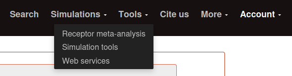

=====
Tools
=====

The tools system englobe all the options found on the `Tools` block. It is necessary to have an account to access to this section. The tools are divided into four main sections:

.. toctree:: 
  :caption: Contents:
  :maxdepth: 2

  cross-receptor-analysis
  workbench
  api
  data-download

